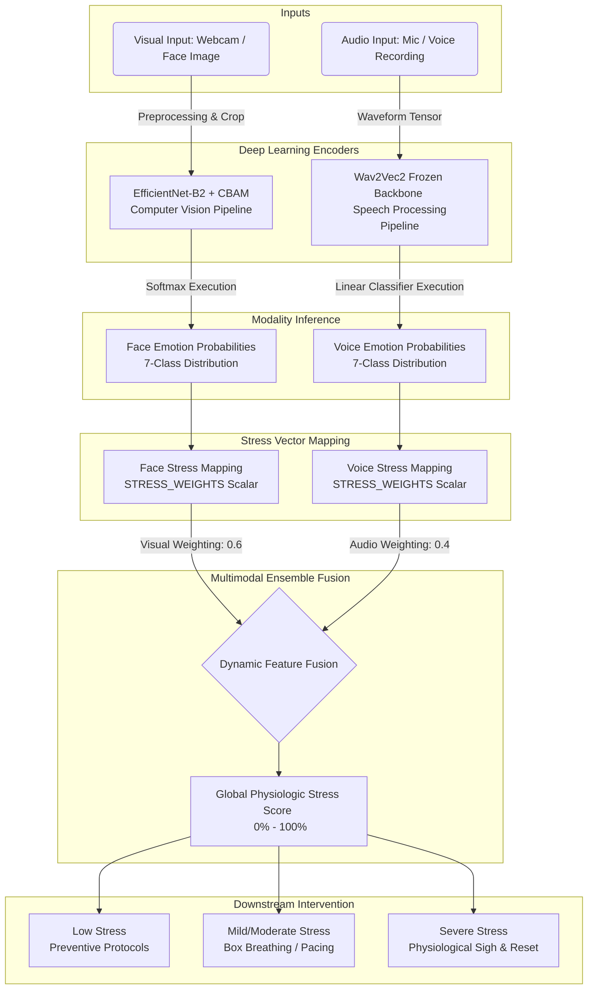

# 🧠 Smart Stress Detection — Face + Voice Fusion

Detect stress levels using a combination of **facial expression analysis** and **voice emotion recognition**.

## Models

| Model | Backbone | Classes | Weight |
|-------|----------|---------|--------|
| Face  | EfficientNet-B2 + CBAM | 7 (angry, disgust, fear, happy, neutral, sad, surprise) | 0.6 |
| Voice | Wav2Vec2 (frozen) + Classifier | Loaded from checkpoint | 0.4 |

## How It Works

1. Upload a **face image** (webcam or file) and/or a **voice recording** (mic or file).
2. Both models predict emotion probabilities independently.
3. Each emotion is mapped to a **stress weight** (e.g., angry → 0.90, happy → 0.10).
4. The final stress score is: `0.6 × face_stress + 0.4 × voice_stress`

## Overall System Architecture

The AI Stress Detection platform utilizes a **Multimodal Fusion Architecture** to achieve high accuracy in stress inference. 
The system runs parallel deep learning branch encoders to interpret completely disparate data streams (visuals and acoustic prosody) before mapping them through a fixed psychological heuristic scalar:

1. **Information Extraction**:
   - The visual branch operates on an EfficientNet-B2 backbone enhanced with a Convolutional Block Attention Module (CBAM) to focus heavily on micro-expressions in isolated face cropping.
   - The audio branch operates on a pre-trained frozen Wav2Vec2 transformer backbone connected to a downstream linear classifier to extract latent vocal stress cues without converting them into transcriptions.
2. **Probability Distribution**: Both encoders return a 7-class discrete emotion probability distribution.
3. **Weight Mapping**: Based on curated psychological heuristics, each of the 7 emotion distributions is subjected to a mathematical transformation into a 'stress scale' penalty. 
4. **Ensemble Fusion**: The final prediction combines the Face state (weighted 60%) and the Acoustic state (weighted 40%), resulting in incredibly resilient physiological predictions. 

### Architecture UML Diagram

## Live Demo & Advanced UI

You can view the full model inference logic deployed on **Hugging Face Spaces**. 
Additionally, we maintain a dynamic, customized front-end UI that visualizes the results natively on a beautiful premium dashboard:
- **Netlify UI Preview**: [ai-stress-detection.netlify.app](http://ai-stress-detection.netlify.app)
- **Actionable Relief Protocols**: Alongside the stress score prediction, the UI dynamically provides evidence-based stress reduction methods (such as Box Breathing, 4-7-8 Breathing, or the Physiological Sigh) tailored precisely to your overall predicted stress bracket.

